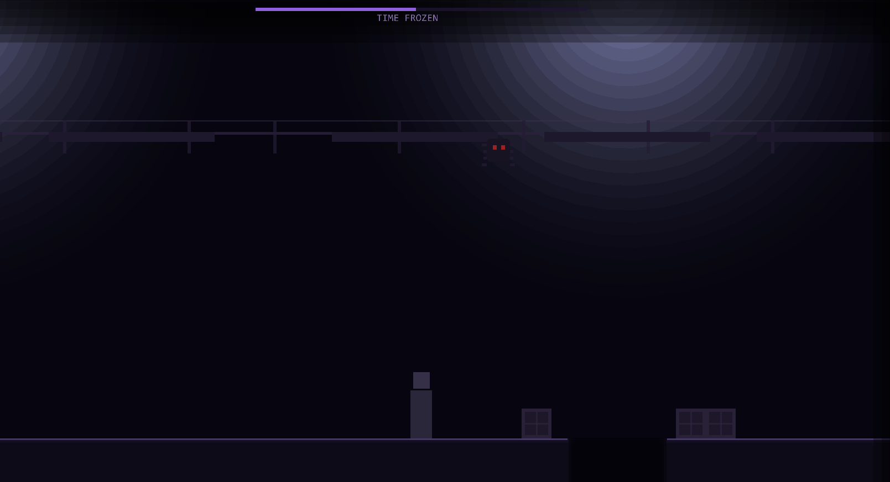

# Shattered Continuum

> A dark, atmospheric 2D platformer built from scratch in the browser.

**[Play it live →](https://shatteredcontinuum.netlify.app/)**

---



---

## Overview

Shattered Continuum is a browser-based 2D platformer where you control Isaac, a man with amnesia trapped inside a prison simulation. An unknown presense guides and sometimes antagonizes you as you navigate procedurally generated levels, manipulate time, and piece together your identity.

Built entirely in vanilla JavaScript with no game engine abstraction — just Kaboom.js and a lot of custom systems.

---

## Gameplay

- Walk Isaac through procedurally generated chunk-based levels
- Collect the **shard** at the end of each level to progress
- Each completion reveals the next letter of a sentence chalked on the wall of the menu room
- Death resets the level with new RNG — *"that future collapsed"*

### Controls

| Key | Action |
|-----|--------|
| `A` / `D` or Arrow Keys | Move |
| `Space` | Jump |
| `E` | Time Freeze / Interact |

---

## Time Freeze

Isaac's core ability is **Time Freeze** — press `E` to pause all moving objects in the level for 5 seconds. Use it to cross flickering platforms, escape shaking boxes, or outrun the smiley entity.

- Freeze has a **partial charge** system — toggle it off early and the remaining charge is preserved
- A full drain triggers a **2.5 second cooldown** before recharging
- The UI bar shows remaining charge (purple) and recharge progress (dim purple)

---

## Level System

Levels are built from fixed and randomized **chunks** assembled in sequence:

- **Chunk 1** — entry room with door, settings desk, and bulletin board
- **Random chunks** — procedurally generated with 4 independent roll systems
- **Chunk 20** — pedestal with the glitching memory shard

Each random chunk independently rolls for:

| Factor | Variants |
|--------|----------|
| **Floor** | Solid / Small gap / Large gap + platform / Extreme gap + 3 platforms |
| **Boxes** | None / Pushable / Shaking (launches Isaac) / Ghost (lethal magnetic pull) |
| **Catwalk** | None / Falling boards / Spider entity / Both |
| **Lighting** | Normal / Fog / Fog + Smiley entity |

Roll ranges are bounded per level to create a smooth difficulty curve across the 10 main levels, while preserving randomness within those bounds.

---

## Technical Highlights

- **Chunk streaming** — active objects (boxes, entities, platforms) are destroyed as Isaac moves forward, keeping physics body count low regardless of level length
- **Per-chunk destroyables tracking** — every expensive `k.add()` call is tracked in a per-chunk array and torn down on demand without affecting static geometry
- **Procedural roll range system** — each level config defines `[min, max]` bounds per roll factor rather than fixed values, allowing controlled randomness across the difficulty curve
- **Partial freeze charge persistence** — freeze state is preserved on manual toggle-off, with separate cooldown logic for full drain vs early deactivation
- **Challenge mode** — unlocked after completing all 10 levels; dual-slider UI per roll factor lets players configure their own level with custom chunk count, launch a fully random run, or complete the difficult max mode.

---

## Stack

| | |
|---|---|
| **Language** | Vanilla JavaScript (ES Modules) |
| **Game Library** | [Kaboom.js](https://kaboomjs.com/) v3000.1.17 |
| **Bundler** | Vite |
| **Deployment** | Netlify (GitHub auto-deploy) |

---

## Running Locally

```bash
git clone https://github.com/ConnorMartin862/ShatteredContinuum
cd ShatteredContinuum
npm install
npm run dev
```

---

## Future Plans

- [ ] Narrator dialogue system
- [ ] Chalk letter reveal animation
- [ ] Art pass — replace placeholder geometry with sprites
- [ ] Challenge mode entities — Mega Smiley, Blue Spider, Ark Bomb
- [ ] Menu room object unlocks tied to level progress

---

*Built by Connor Martin — [Portfolio](https://connormartin862.github.io/projects.html)*
